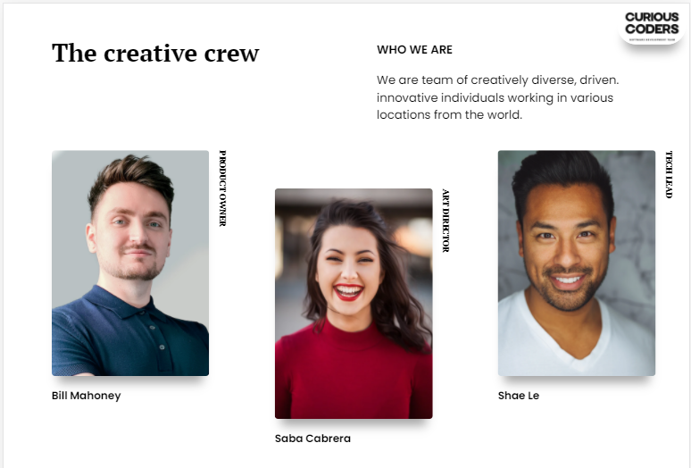

<h1 align="center">My Team Member List</h1>


<div align="center">
  <h3>
    <a href="https://your-demo-link.your-domain"> <!-- Add gihub server page link :) -->
      Demo
    </a>
     | 
    <a href="https://github.com/nurkocar/Project_CssGrid_and_ResponsiveLayout___My_Team___-">
      Project
    </a>
 
  </h3>
</div>


<!-- TABLE OF CONTENTS -->

## Table of Contents

- [Overview](#overview)
- [Built With](#built-with)
- [Features](#features)
- [How to use](#how-to-use)
- [Contact](#contact)

<!-- OVERVIEW -->

## Overview

This is the mobile view of my page


This is the Complete view of my page


 

### Built With

<!-- This section should list any major frameworks that you built your project using. Here are a few examples.-->

- HTML
- CSS (Grid&ResponsiveLayout)


## Features

This application/site was created as a submission to a [Clarusway](https://clarusway.com) Project. 

## How To Use

<!-- This is an example, please update according to your application -->

To clone and run this application, you'll need [Git](https://git-scm.com).From your command line:

```bash
# Clone this repository
$ git clone https://github.com/nurkocar/Project_CssGrid_and_ResponsiveLayout___My_Team___-.git
```

## Contact

- GitHub [@nurkocar](https://github.com/nurkocar)

- Linkedin [@nur-kocar](https://www.linkedin.com/in/nur-kocar/)

